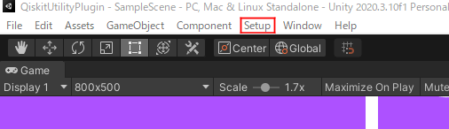

# Releases
 
"hoge"のセールスポイントや差別化などを説明する
 
# Requirement
・Python3
・pip3
・Unity 2020.3.20f1
    
# Setup
    Press "Setup" button.
    
    It will install required python librarys to your environment.
